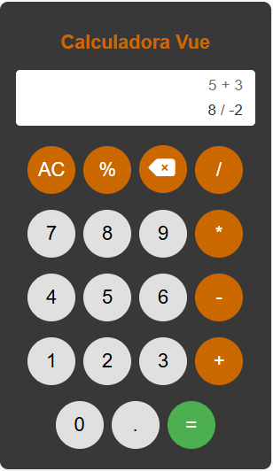

# 📱 Calculadora con Vue

Una calculadora sencilla desarrollada con **Vue 3**.  
Este proyecto lo realicé como práctica personal para reforzar mis conocimientos de Vue y lógica de programación.

---

## ✨ Características
- Operaciones básicas: **suma, resta, multiplicación, división y porcentaje**  
- Manejo de errores 
- Diseño moderno con **SCSS**  
- Iconos con **Font Awesome**  
- Responsive y fácil de usar

---

## 🖼️ Captura de pantalla

  

---

## 🛠️ Tecnologías utilizadas
- [Vue 3](https://vuejs.org/) - Framework frontend
- [SCSS](https://sass-lang.com/) - Estilos
- [Font Awesome](https://fontawesome.com/) - Iconos

---

## ⚙️ Instalación y ejecución

-Clona el repositorio:

  git clone https://github.com...
  
  cd vue-calculator
  
-Instala las dependencias:

  npm install
  
-Ejecuta el servidor de desarrollo:

  npm run dev
  

---

📧 criisv95@gmail.com

🌐 www.linkedin.com/in/cristian-vera-desarrollador
